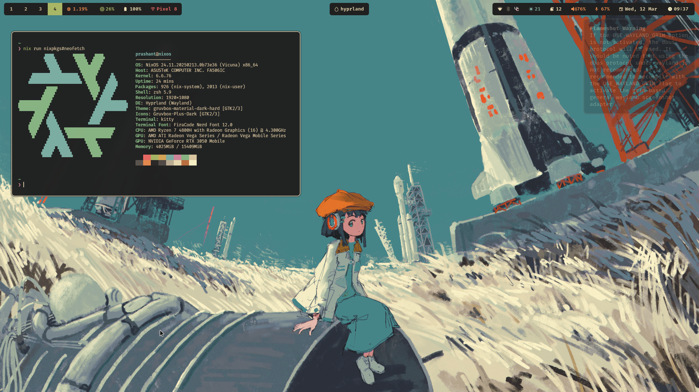

### My Personal Dotfiles

NixOS configration files using Flakes and Home Manager.



For my own reference:
```sh
# After installting nix on a new system enable it adding this
# to /etc/nixos/configration.nix
nix.settings.experimental-features = [ "nix-command" "flakes" ];

# dont forget to then rebuild system
sudo nixos-rebuild switch 

# new nix shell environment with git
nix-shell -p git

# clone repo 
git clone --depth 1 https://github.com/prashantrahul141/dotfiles -o nixos

# copy new hardware configuration and override the old on.
rm ./nixos/hosts/thorfinn/hardware.nix
cp /etc/nixos/hardware-configuration.nix ./nixos/hosts/thorfinn/hardware.nix

# rebuild using flakes in this directory
sudo nixos-rebuild switch --flake .#thorfinn

```
